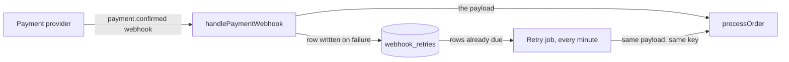

<p align="center">
  
</p>

<p align="center">
  
  
  
  
</p>

<p align="center">
  <b>Your agent is three files deep into a story you never asked about. Type <code>/dumb</code>.</b>
</p>

---

Coding agents are very good at doing the work and very bad at telling you why they are doing it. You watch a migration appear, a job get scheduled, a column get indexed, and the honest answer to "why this, now?" is somewhere in a story file you have not opened.

`/dumb` is an [Agent Skill](https://agentskills.io) that answers that question from where you actually are. It reads the story, its epic and the code around the change, then explains in short sentences, one idea at a time, and offers to go deeper only if you want it. In your language.

It works in **Claude Code, Cursor, Codex and OpenCode**, installs with one command, and has zero runtime dependencies.

## What it looks like

`/dumb` writes a full explainer into your repo, then keeps the chat to a few lines and a path. Depth belongs in a document you can scroll, not in a wall of chat text.

Excerpt from `docs/dumb/2026-09-22-retry-webhook-backoff.md`. The real file also carries the system design, every other part, common mistakes, a self-check and a glossary.



#### Why this exists

Epic 5 promises that a confirmed payment always becomes a paid order, because a customer whose money left their account and whose order still says "pending" will charge back and stop trusting the shop. Today the provider tells us once, and `handlePaymentWebhook` processes it immediately. If the order service is down for that one second, the message is gone and nobody retries, so the payment is lost silently. Story 5.4 already made reprocessing safe to repeat, which is what makes an automatic retry possible at all.

#### handlePaymentWebhook

**In general** — A webhook is one system calling another to announce that something happened, so the receiver never has to ask. The usual alternative is polling, where you ask "is it paid yet?" on a timer, which wastes calls and still adds delay.

**In this project** — The exported function in `src/payments/webhook.ts`. The provider posts the confirmation to it, and it calls `processOrder` straight away.

**How it connects** — The provider feeds it; it feeds `processOrder`. After this story it also feeds `webhook_retries` whenever `processOrder` throws, and the retry job picks up from there.

**❌ Doing it wrong** — Catching the error and returning 200 without storing anything. The provider sees success and never sends the message again, so the payment is lost with no trace to debug.

**✅ Doing it right** — Write the payload to `webhook_retries` before returning, because that row is the only evidence the payment arrived, and the retry job has nothing to work from without it.

Every rule, number and design choice in that file carries its reason. "AC 2 defines 1m, 5m, 25m, 2h" is a failure; the reason those intervals grow is the point.

## Install

```bash
npx total-dumb
```

It detects the agents you have, asks global or project, and copies the skill.

```bash
npx total-dumb -y                         # all detected agents, global
npx total-dumb --project                  # into the current repo
npx total-dumb --agents claude,codex -g   # pick agents
npx total-dumb --uninstall                # remove it again
npx total-dumb --dry-run                  # show what would happen, write nothing
```

Also available through the `skills` CLI:

```bash
npx skills add OyakSaile/dumb
```

## Four levels

Every level except `terms` writes the document. The level sets how deep the document goes and how much the chat asks you.

| You type | You get |
|---|---|
| `/dumb` | the full document, then a few lines in chat and one line offering to explain a term or move on |
| `/dumb zero` | the full document with a wider glossary and an everyday analogy per part; the chat stops and asks which term to explain, plus one question to check you followed |
| `/dumb senior` | the document without glossary or analogies, with the trade-offs and the alternatives that were rejected; the chat asks nothing |
| `/dumb terms` | no file, just the vocabulary of this step in chat, each term with an example from your task |

Aliases: `eli5`, `beginner` and `junior` for `zero`; `pro` and `expert` for `senior`; `termos`, `jargon` and `glossary` for `terms`.

With no level given it reads your message. Use the step's terms correctly, or ask a sharp trade-off question, and you get the `senior` treatment. Say "I'm lost" and you get `dev`. It will not offer to define a word you just used correctly.

You do not have to use the slash command. "why are we doing this?", "what is this for?", "I don't get it", "explain this step" all trigger it mid-task. Ask in any language and both the document and the reply come back in it, headers included.

## What lands in your repo

```
docs/dumb/2026-09-22-retry-webhook-backoff.md
```

One file per feature, rewritten when you ask again. Inside: why it exists, the big picture as a labelled Mermaid flow, the system design with the current feature highlighted and the planned connections dotted, a sequence diagram of the main path including the failure branch, then every part with what it is in general, what it is here, what it connects to, a worked example, and a wrong-way and right-way pair. It closes with the common mistakes on this feature, three questions with collapsed answers, and a glossary.

## Where the "why" comes from

It reads at most three files and stops as soon as it can be specific.

- **BMAD projects** (`docs/stories/` exists): the story file, then its epic, then the PRD. That order fills the dependency chain first, which is why the example above knows that 5.7 is blocked.
- **Everything else**: `README`, `docs/`, `ROADMAP`, ADRs, `PLAN`/`TODO`, `AGENTS.md`, then the code around the change.
- **No planning docs at all**: it says so in one line, then reasons from the callers, the tests and the git history instead of inventing a rationale.

If the motivation is weak or the step looks unnecessary, it says that too. Learning to judge the work is part of the point.

## Where it gets installed

| Agent | Project (`--project`) | Global (default) |
|---|---|---|
| Claude Code | `.claude/skills/dumb` | `~/.claude/skills/dumb` |
| Cursor | `.agents/skills/dumb` | `~/.cursor/skills/dumb` |
| Codex | `.agents/skills/dumb` | `~/.codex/skills/dumb` |
| OpenCode | `.agents/skills/dumb` | `~/.config/opencode/skills/dumb` |

`CLAUDE_CONFIG_DIR`, `CODEX_HOME` and `XDG_CONFIG_HOME` are honored.

## How it was built

Test-first, the same way you would build a feature. The scenario was run against a fixture repo by fresh subagents **without** the skill to establish a baseline, then again with it.

The baseline answers were not wrong, they were shapeless: five of five runs produced a correct 322 to 382 word essay with no analogy, no pitfalls, no reflection question and no distinct next step. Every element the skill enforces exists because a real run dropped it, and three rounds of fixes each closed a failure that was actually observed rather than imagined.

## License

MIT © Kayo Elias
