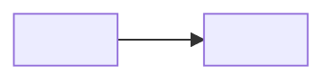
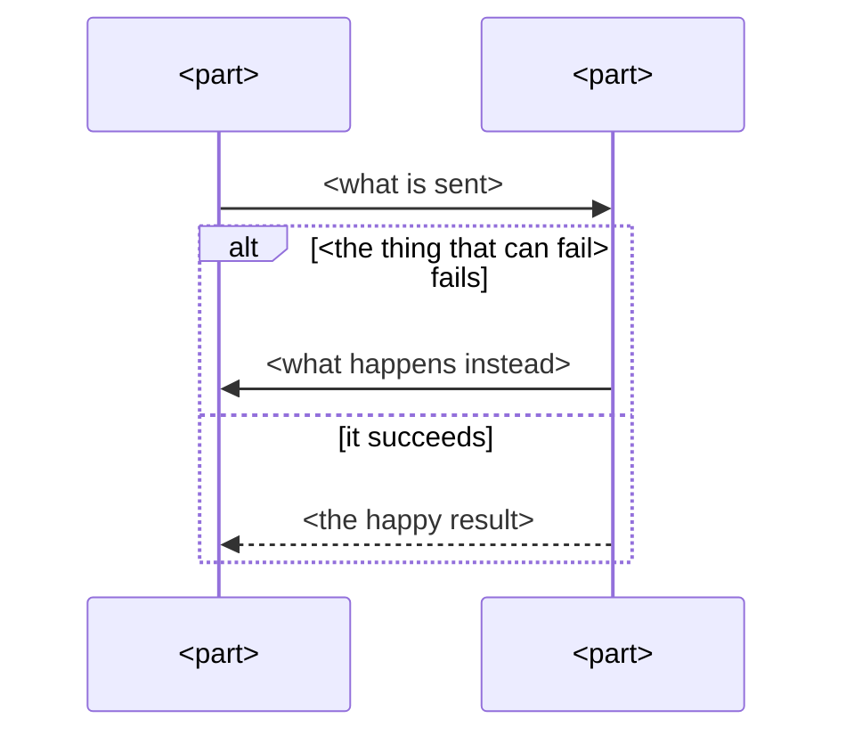
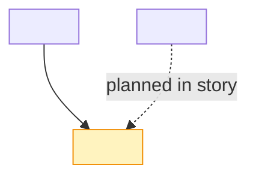

# The explainer document

Write it to `docs/dumb/<yyyy-mm-dd>-<feature-slug>.md`. Create `docs/dumb/` if it does not exist. If a file matching `docs/dumb/*-<feature-slug>.md` is already there, overwrite that file and keep its name (one document per feature, updated on every run). No file is written at `terms`.

There is no length limit. The document is as long as the parts need: never shorten a part, drop a layer or skip an example to save space. A six-part feature can run past 2,000 words and that is fine. Every section is grounded in this project, with real names. The simplicity rules still apply sentence by sentence, and every rule, number and design choice carries its reason.

Headers below are shown in English, the canonical form; render them in the user's language.

## Template

````markdown
# <Feature or story name> — explained

## Why this exists
<4–8 sentences. The goal in plain words. What breaks or gets worse without it.
Who benefits. Every claim carries its reason. No chains of story IDs.
At `senior`, also the trade-offs and the alternatives that were considered.>

## The big picture
<2–3 sentences naming the flow, then the diagram. The diagram never replaces them.>



`<part> → <part> → <part>`

<Then the main walk-through as a sequence diagram, including the failure branch.>



## System design
<The components that exist today, how they connect, where this feature plugs in,
and what is planned next. If no architecture doc exists, derive it from the code
and say that is what you did.>



`<component> → <component> → <component>`

## The parts, one by one

### <Part, by its real name>
**In general** — <1–2 plain sentences: what this kind of thing is and how it works
anywhere, with the usual alternative for contrast, such as a webhook against polling,
a queue against a direct call, a worker against doing the work inside the request.
At `zero`, one everyday analogy here.>
**In this project** — <file, function, config, real names, and how a message actually
flows through it here.>
**How it connects** — <what feeds it and what it feeds, today, and what is planned next.>
**Example** — <one concrete walk-through with real values.>
**❌ Doing it wrong** — <a realistic mistake on this part and what breaks because of it.>
**✅ Doing it right** — <the correct approach and why it works.>

## Common mistakes on this feature
- <mistake> → <the symptom you would see> → <the fix>
  <3 to 5 of these.>

## Check yourself
1. <question>
2. <question>
3. <question>

<details>
<summary>Answers</summary>

1. <answer>
2. <answer>
3. <answer>

</details>

## Glossary
- **<term>** — <one plain line>. <For a component, the three layers in one line each.>

<Omitted entirely at `senior`.>

## Next step
<One line: where the task resumes.>
````

## Diagram rules

- At most 10 nodes per diagram. If it needs more, the diagram is at the wrong altitude.
- Every edge in the big-picture diagram is labelled with **what flows**, not with a verb alone.
- Use the pipe form for labels, `A -->|"text"| B`, and quote every label. Dotted edges for planned connections, `A -.->|"planned in story 5.8"| B`.
- Node labels use plain words the reader has already met. A diagram never introduces a new term.
- One ASCII fallback line goes directly under each `flowchart` block, for readers whose viewer has no Mermaid.
- A diagram never replaces the sentence that explains it.
- Style the current feature's parts in the system-design diagram with `classDef current fill:#fff3bf,stroke:#f08c00` and a matching `class` line.
- Render labels in the user's language.
- Keep the syntax conservative and re-read every block before finishing. Nothing renders it here, so a typo ships.
- Use two small `flowchart` blocks for ❌ against ✅ only when the difference is structural, such as a retry loop with and without an idempotency key. Otherwise prose is better.

## By level

| Level | Glossary | Analogies | "Why this exists" | ❌/✅ examples |
|---|---|---|---|---|
| `dev` | yes | where they help | goal and consequences | realistic implementation mistakes |
| `zero` | expanded, every term | one per part, in "In general" | goal and consequences, extra plain | beginner mistakes |
| `senior` | none | none | plus trade-offs and alternatives considered | design choices, such as at-least-once against exactly-once |

## Worked excerpt

From `docs/dumb/2026-09-22-retry-webhook-backoff.md`, the why and one part.

````markdown
## Why this exists

Epic 5 promises that a confirmed payment always becomes a paid order, because a
customer whose money left their account and whose order still says "pending" will
charge back and stop trusting the shop. Today the payment provider tells us once,
and `handlePaymentWebhook` processes it immediately. If our order service is down
for that one second, the message is gone and nobody ever retries, so the payment is
lost silently. Story 5.4 already made reprocessing safe to repeat, which is what
makes an automatic retry possible at all. This story adds the place to keep a failed
message and the schedule for trying it again.

### handlePaymentWebhook
**In general** — A webhook is one system calling another to announce that something
happened, so the receiver does not have to ask repeatedly. The usual alternative is
polling, where you ask "is it paid yet?" on a timer, which wastes calls and still
adds delay.
**In this project** — It is the exported function in `src/payments/webhook.ts`. The
provider posts the confirmation to it, and it calls `processOrder` straight away.
**How it connects** — The payment provider feeds it, and it feeds `processOrder`
today. After this story it also feeds the `webhook_retries` table whenever
`processOrder` throws, and the retry job picks up from there.
**Example** — A payment clears, the provider posts `{"id":"pay_123","status":"paid"}`,
the function calls `processOrder` with it, and the order flips to paid.
**❌ Doing it wrong** — Catching the error and returning 200 without storing anything.
The provider sees success and never sends the message again, so the payment is lost
with no trace to debug.
**✅ Doing it right** — Write the payload to `webhook_retries` before returning, because
the row is the only evidence that the payment arrived, and the retry job has nothing
to work from without it.
````
